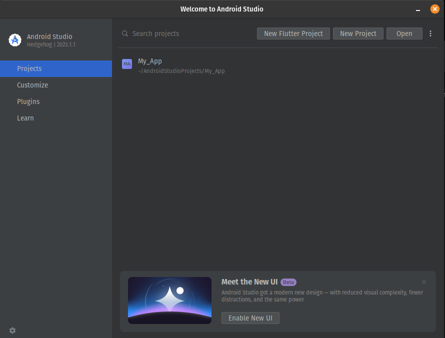
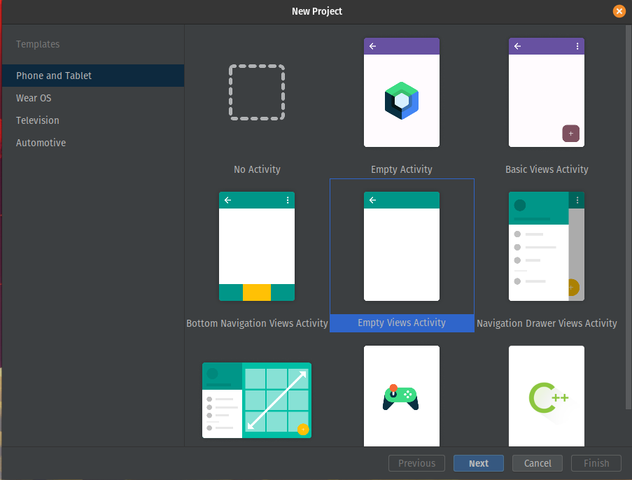
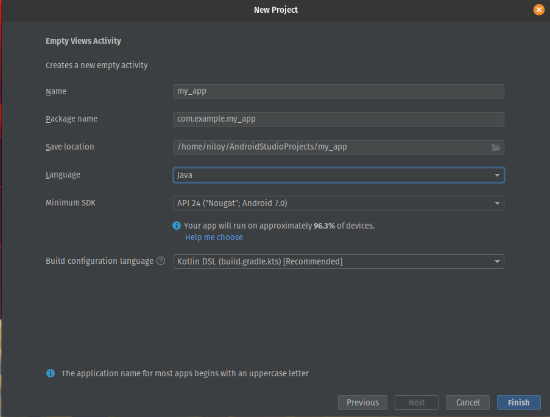
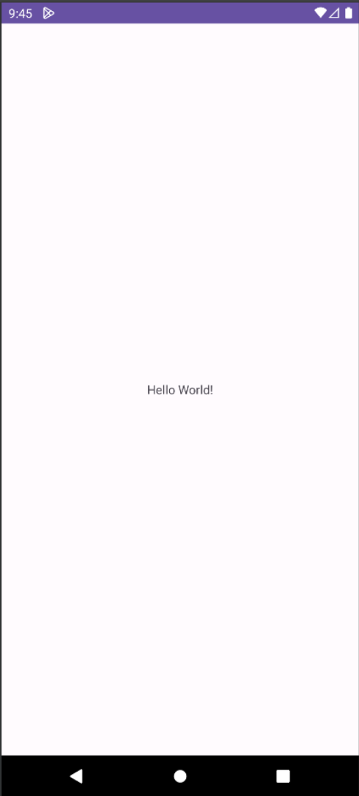
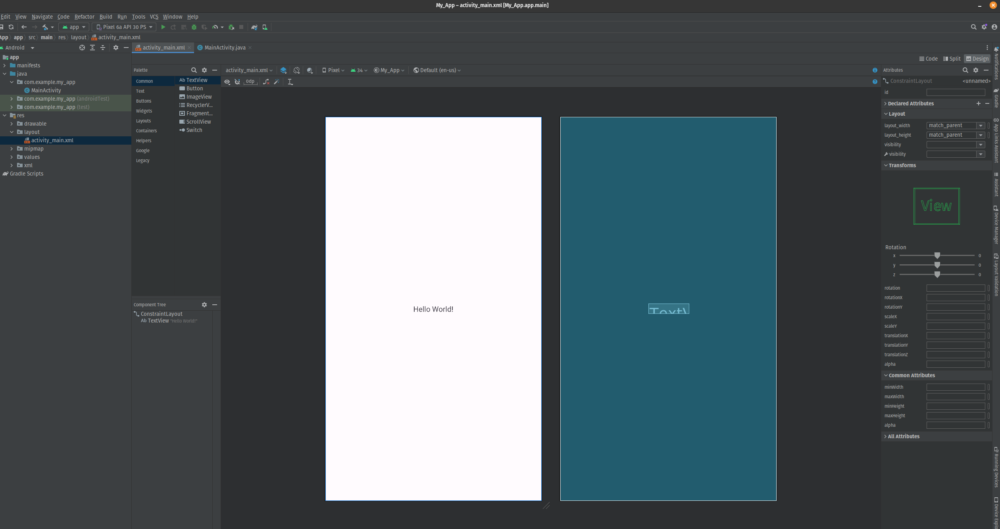
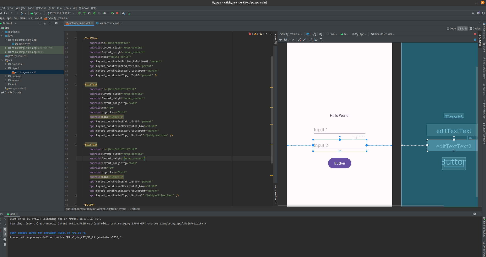
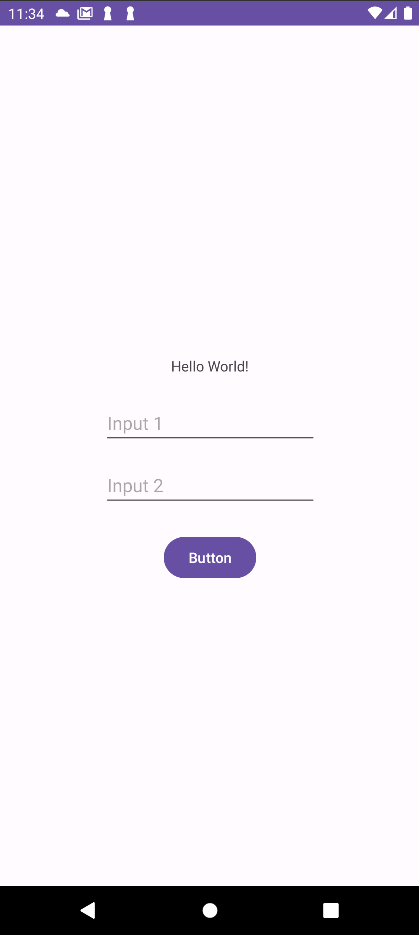

# Native Android Handover
OpenJDK: 17

### 1. Open up Android Studio and click on New Project
<p align="center">
    </img>
</p>

### 2. Select empty activity
<p align="center">
    </img>
</p>

### 3. Give a proper name to the project
<p align="center">
    </img>
</p>

### 4. After the project create completion, pressing the run or debug button, a default hello world screen will appear with the emulator.
<p align="center">
    </img>
</p>

### 5. Go to [activity_main.xml](./app/src/main/res/layout/activity_main.xml)
<p align="center">
    </img>
</p>

### 6. Go to Code from the top right corner and insert the textfields
<p align="center">
    </img>
</p>

```xml
    <TextView
        android:id="@+id/textView"
        android:layout_width="wrap_content"
        android:layout_height="wrap_content"
        android:text="Hello World!"
        app:layout_constraintBottom_toBottomOf="parent"
        app:layout_constraintEnd_toEndOf="parent"
        app:layout_constraintStart_toStartOf="parent"
        app:layout_constraintTop_toTopOf="parent"
        app:layout_constraintVertical_bias="0.393" />

    <EditText
        android:id="@+id/editTextText"
        android:layout_width="wrap_content"
        android:layout_height="wrap_content"
        android:layout_marginTop="24dp"
        android:ems="10"
        android:inputType="text"
        android:hint="Input 1"
        app:layout_constraintEnd_toEndOf="parent"
        app:layout_constraintHorizontal_bias="0.502"
        app:layout_constraintStart_toStartOf="parent"
        app:layout_constraintTop_toBottomOf="@+id/textView" />

    <EditText
        android:id="@+id/editTextText2"
        android:layout_width="wrap_content"
        android:layout_height="wrap_content"
        android:layout_marginTop="16dp"
        android:ems="10"
        android:inputType="text"
        android:hint="Input 2"
        app:layout_constraintEnd_toEndOf="parent"
        app:layout_constraintHorizontal_bias="0.502"
        app:layout_constraintStart_toStartOf="parent"
        app:layout_constraintTop_toBottomOf="@+id/editTextText" />

    <Button
        android:id="@+id/button"
        android:layout_width="wrap_content"
        android:layout_height="wrap_content"
        android:layout_marginTop="24dp"
        android:text="Button"
        app:layout_constraintEnd_toEndOf="parent"
        app:layout_constraintStart_toStartOf="parent"
        app:layout_constraintTop_toBottomOf="@+id/editTextText2" />
```

### 7. Go to [MainActivity.java](./app/src/main/java/com/example/my_app/MainActivity.java), and instantiate the ui elements
```java
public class MainActivity extends AppCompatActivity {

    private EditText editText1;
    private EditText editText2;
    private Button button;

    @Override
    protected void onCreate(Bundle savedInstanceState) {
        super.onCreate(savedInstanceState);
        setContentView(R.layout.activity_main);

        editText1 = findViewById(R.id.editTextText);
        editText2 = findViewById(R.id.editTextText2);
        button = findViewById(R.id.button);

        button.setOnClickListener(v -> {
            // TODO: Do button click operations
        });
    }

}
```

### 8. If everything is done correctly, run the app, and it should look something like this-
<p align="center">
    </img>
</p>

### 9. If you wish to publish your app to Google Play Store, follow the official documentation-
* [https://developer.android.com/studio/publish](https://developer.android.com/studio/publish)
